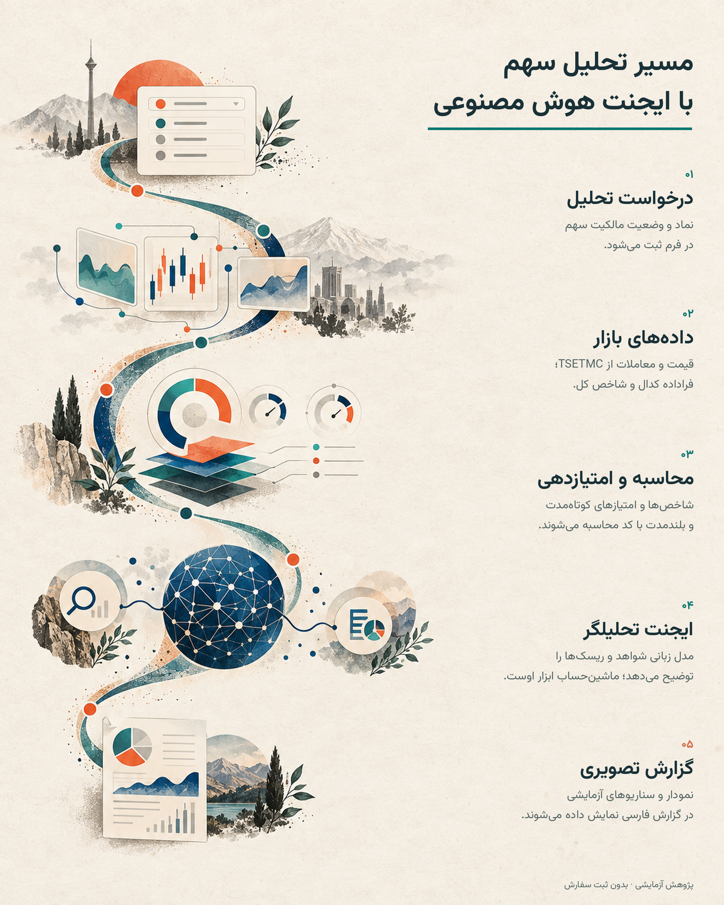
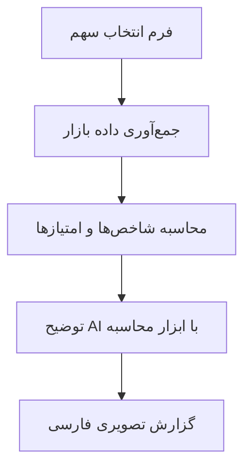

# آزمایشگاه هوشمند سهام ایران
### از انتخاب نماد تا یک گزارش تحلیلی منسجم

**یک پروژه آزمایشی با n8n؛ ترکیب داده‌های بورس ایران، محاسبات قانون‌محور و توضیحات هوش مصنوعی.**

[English](README.md) · [فایل فلو](workflows/iran-stock-ai-analyst.json) · [متن‌های لینکدین](docs/LINKEDIN_POSTS.md)

**n8n · TSETMC · OpenAI · فارسی و راست‌به‌چپ · گزارش HTML**

## ایده از کجا شروع شد؟

یک آزمایش در اوقات فراغت: می‌شود اطلاعات پراکنده یک سهم را به تجربه‌ای یکپارچه و تصویری برای بررسی تبدیل کرد؟

کاربر نماد را انتخاب می‌کند و می‌گوید سهم را دارد یا نه. فلو داده‌ها را جمع می‌کند، شاخص‌ها را محاسبه می‌کند و یک گزارش فارسی می‌سازد. منطق اصلی ساده است: **کد محاسبه کند، AI توضیح بدهد و تصمیم با انسان بماند.**

> این پروژه نمونه اولیه پژوهشی است؛ نه ربات معامله‌گر. سفارشی ثبت نمی‌کند و دقت پیش‌بینی یا سودآوری آن اثبات نشده است.

## داخل این فلو چه می‌گذرد؟

| بخش | کارکرد |
| --- | --- |
| دریافت درخواست | فرم n8n، انتخاب سریع یا ورود نماد دلخواه، مالکیت سهم و میانگین خرید اختیاری |
| جمع‌آوری داده | قیمت و تاریخچه، معاملات حقیقی/حقوقی، آمار نماد، فراداده اطلاعیه‌های کدال و تاریخچه شاخص کل |
| محاسبات | روند، مومنتوم، حجم، جریان پول و امتیازهای کوتاه‌مدت و بلندمدت قانون‌محور |
| هوش مصنوعی | توضیح شواهد، ریسک‌ها و محرک‌ها با دسترسی به ابزار ماشین‌حساب |
| خروجی | گزارش HTML راست‌به‌چپ با نمودار، کارت امتیاز، سابقه قیمت و سناریوهای آزمایشی آینده |

## معماری

جمع‌آوری داده در نودهای ازپیش‌تعریف‌شده انجام می‌شود؛ ایجنت مستقلاً مسیر تحقیق را برنامه‌ریزی نمی‌کند. پرامپت از مدل می‌خواهد امتیازها و برچسب تصمیم محاسبه‌شده را تغییر ندهد؛ این دستور، تضمین فنی اجرای صحیح نیست.

### تصاویر واقعی فلو

## اجرای آزمایشی

۱. یک n8n با پشتیبانی از نودهای Form، Code، HTTP Request و AI موجود در فایل آماده کنید. سازگاری همه نسخه‌های n8n بررسی نشده است.

۲. [فایل JSON](workflows/iran-stock-ai-analyst.json) را دانلود و داخل n8n ایمپورت کنید.

۳. در **OpenAI Chat Model**، اعتبارنامه خودتان را انتخاب کنید و مدل سازگار و در دسترس را مشخص کنید. مصرف API ممکن است هزینه داشته باشد.

۴. اتصال میزبان n8n به سرویس OpenAI و آدرس‌های TSETMC را بررسی کنید؛ بازشدن سایت در مرورگر به‌تنهایی کافی نیست.

۵. اجرای تست را آغاز کنید و فرم تست **Stock Analysis Form** را باز کنید. نماد، وضعیت مالکیت و در صورت نیاز میانگین خرید را به **ریال** وارد کنید.

۶. خروجی نودهای دریافت داده و امتیازدهی را بررسی کنید؛ سپس گزارش **Interactive Stock Report** را بخوانید. نماد، تاریخ، داده مفقود و تفاوت ریال/تومان را کنترل کنید.

۷. تا پایان تست، فرم را خصوصی نگه دارید. پیش از انتشار آدرس عمومی، کنترل دسترسی و سقف هزینه را بررسی کنید.

این پروژه به کارگزاری، متاتریدر یا حساب معاملاتی نیاز ندارد. برای endpointهای عمومی داده، کلید API در فلو تنظیم نشده است؛ این به معنی تضمین دسترسی یا مجازبودن هر نوع استفاده نیست.

## محدودیت‌هایی که باید شفاف باشند

- **سناریوهای یک، سه و دوازده‌ماهه فرمول‌های ابتکاری‌اند**؛ مدل آموزش‌دیده پیش‌بینی نیستند. بک‌تست یا ارزیابی خارج از نمونه ارائه نشده و برچسب اطمینان، احتمال کالیبره‌شده نیست.
- بخش دارای عنوان «۵۲ هفته» فعلاً حداکثر **۲۴۰ مشاهده معاملاتی موجود** را می‌سنجد، نه دقیقاً یک سال تقویمی. تاریخچه کوتاه‌تر پوشش کمتری دارد.
- قیمت اصلی گزارش از آخرین **قیمت پایانی تاریخی موجود** می‌آید؛ لزوماً آخرین معامله لحظه‌ای نیست.
- داده قیمت ممکن است بابت سود نقدی و افزایش سرمایه تعدیل نشده باشد؛ بازده‌ها و اندیکاتورها نیاز به کنترل دارند.
- کدال در این نسخه شامل **فراداده اطلاعیه‌ها** است؛ نه خواندن و راستی‌آزمایی کامل صورت‌های مالی.
- افق تصمیم و ریسک‌پذیری از کاربر دریافت می‌شوند، اما فعلاً فرمول‌های امتیازدهی را تغییر نمی‌دهند.
- برچسب‌های خرید، انتظار یا بازبینی نگهداری، خروجی آزمایشی برای بررسی‌اند؛ توصیه شخصی سرمایه‌گذاری نیستند.
- endpointهای عمومی ممکن است تغییر کنند یا داده ناقص بدهند. محاسبه RSI نیز ساده‌شده است، نه هموارسازی Wilder.

## مسیر توسعه

- [ ] کنترل پوشش تقویمی تاریخچه و نمایش کیفیت داده
- [ ] قیمت تعدیل‌شده و مدیریت رویدادهای شرکتی
- [ ] ارزیابی زمانی و مقایسه با مدل‌های پایه ساده
- [ ] سنجش عدم‌قطعیت و خودداری از نتیجه‌گیری با داده ناکافی
- [ ] خواندن متن کامل کدال با ارجاع قابل‌پیگیری
- [ ] قواعد متناسب با ورودی کاربر و کنترل دسترسی و هزینه

پوشه `workflows` فایل قابل‌ایمپورت، `assets` پوسترهای فارسی و انگلیسی و تصاویر واقعی، و `docs` متن‌های معرفی و چک‌لیست انتشار را دارد. پوسترها تصویرسازی مفهومی‌اند و نمایش عملکرد بازار نیستند. تصاویر فلو نیز دقت تحلیل یا سودآوری را اثبات نمی‌کنند.

هنوز مجوز متن‌باز برای پروژه انتخاب نشده است؛ پیش از معرفی آن به‌عنوان «متن‌باز»، مجوز مناسب را تعیین کنید.

**صرفاً برای پژوهش و آموزش؛ داده و نتیجه را مستقل بررسی کنید.**
