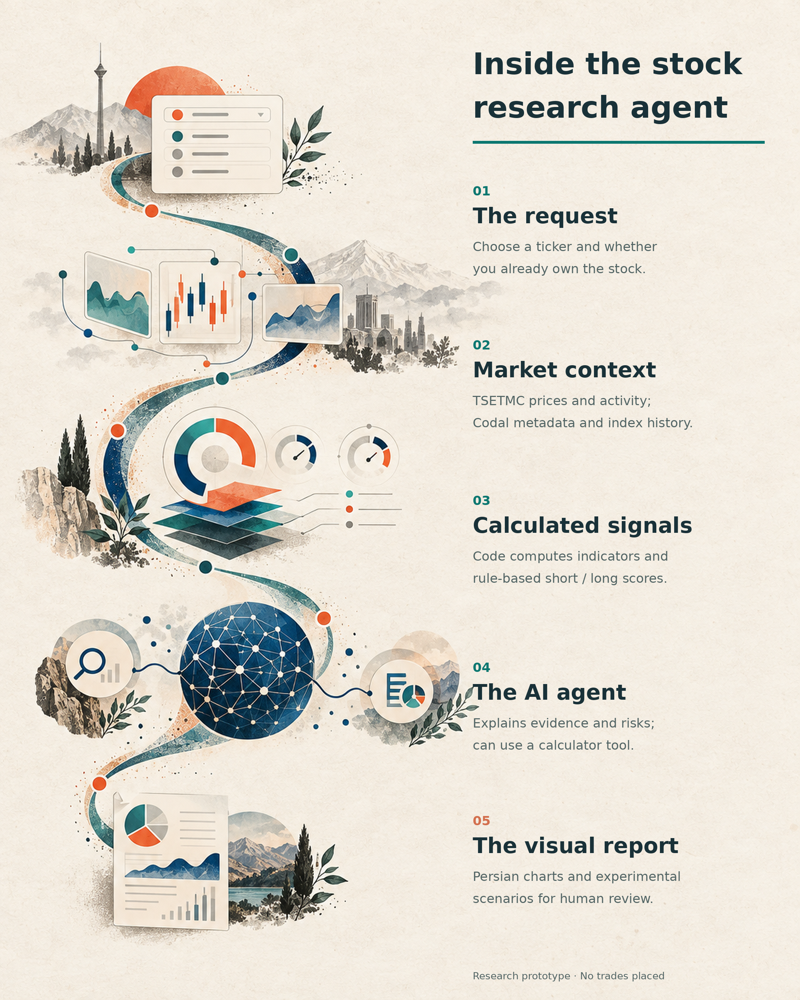
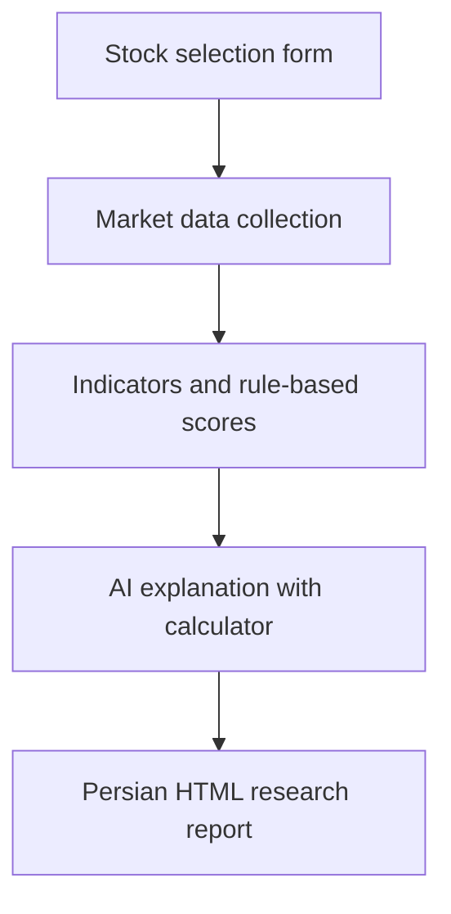
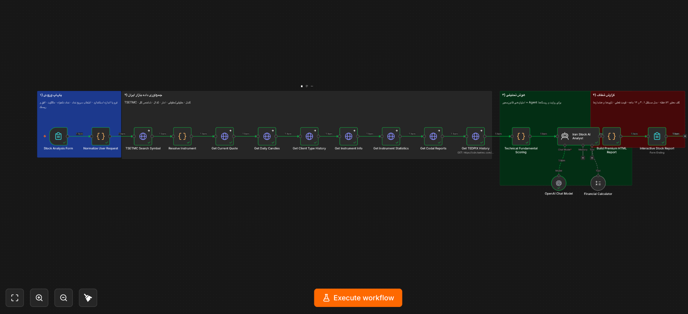
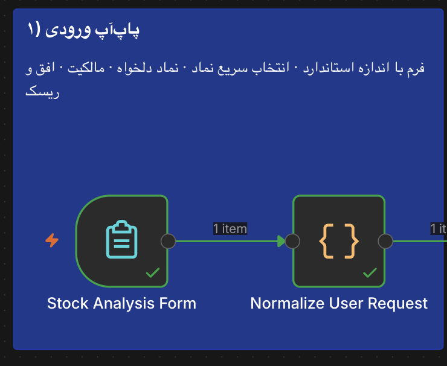
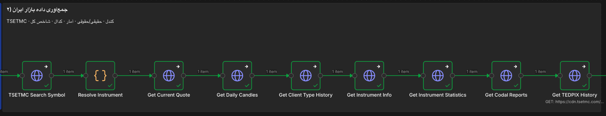
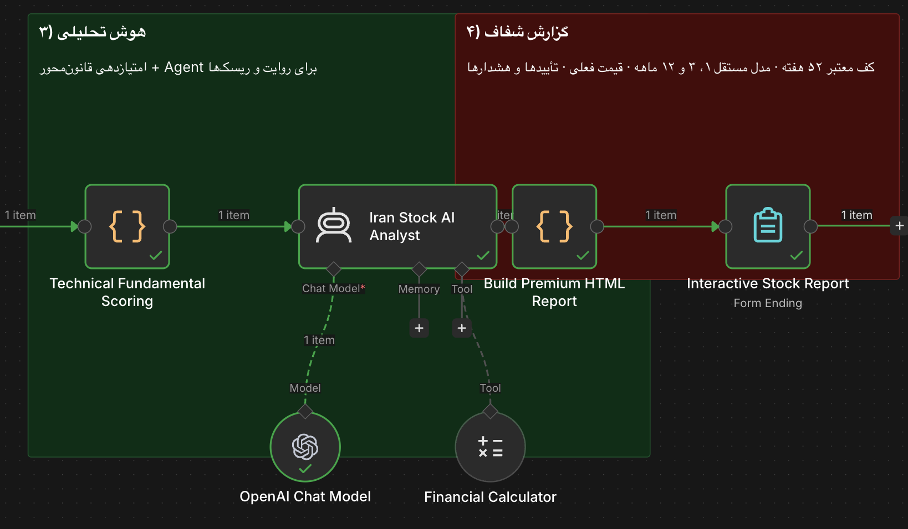

# Iran Stock Intelligence Lab
### From a ticker to a structured research brief.

**An experimental n8n workflow combining Iranian market data, rule-based analysis and AI-written explanations.**

[فارسی](README.fa.md) · [Workflow](workflows/iran-stock-ai-analyst.json)

**n8n · TSETMC · OpenAI · Persian / RTL · HTML Reports**

## A small experiment in making research easier

This started as a spare-time question: could scattered market information become a coherent, visual research experience?

Select an Iranian stock, indicate whether you already own it, and let the workflow gather data, calculate indicators and produce a Persian HTML report. The interesting part is the separation of responsibilities: code calculates; AI explains; the reader decides.

> Research prototype, not a trading system. No orders are placed. Forecast accuracy and investment performance have not been established.

## What is inside

| Layer | What it does |
| --- | --- |
| Input | Native n8n form, quick symbol selection or free-text ticker, ownership and optional purchase price |
| Data | TSETMC quote/history, client-type activity, instrument statistics, Codal report metadata and TEDPIX history |
| Calculation | Trend, momentum, volume, flow and rule-based short/long-term scores |
| AI | Explains supplied evidence, risks and catalysts; a calculator is available as a tool |
| Output | RTL HTML report with charts, score cards, historical context and experimental horizon scenarios |

## Architecture

Data collection is orchestrated by fixed workflow nodes, not autonomously planned by the agent. The AI prompt instructs the model to preserve the computed scores and action label; this is a prompt constraint, not a formal guarantee.

### Inside the actual workflow

## Run your own experiment

1. Use an n8n instance with the Form, Code, HTTP Request and AI nodes included in the export. Version compatibility has not been certified across n8n releases.
2. Download and import [the workflow JSON](workflows/iran-stock-ai-analyst.json).
3. Open **OpenAI Chat Model**, select your own n8n credential and explicitly choose an available compatible model. API usage may incur charges.
4. Confirm that the n8n host can reach the TSETMC endpoints and OpenAI. Browser access alone does not establish host connectivity.
5. Start a test execution and open the test form from **Stock Analysis Form**. Choose a symbol, ownership and optional purchase price in **Iranian rial**, then submit.
6. Inspect the data-fetch and scoring nodes before trusting the resulting **Interactive Stock Report**. Check symbol resolution, dates, missing data and rial/toman units.
7. Keep the form private while testing. Review authentication, access control and spending limits before exposing a production URL.

No broker, MetaTrader installation or trading account is required. Public data endpoints used here do not have a configured data API key; that is not a guarantee of availability or permission for every use.

## Read the output correctly

The most important boundaries are documented, not hidden:

- **One-, three- and twelve-month scenarios are handcrafted heuristics**, not trained forecasting models. No out-of-sample accuracy or backtest is supplied. Confidence labels are not calibrated probabilities.
- The display labelled **52 weeks** currently uses up to **240 available trading observations**, not a strict calendar-year window. Short histories further reduce coverage.
- The report's main price comes from the latest available historical **close**, not necessarily the live last trade.
- Prices may be unadjusted for corporate actions. Returns and indicators require checking around dividends and capital changes.
- Codal integration retrieves **report metadata**, not a verified full-text financial-statement analysis.
- Horizon and risk profile are collected by the form, but do not currently change the rule-based score formulas.
- Action labels are research prompts, not personalized investment recommendations. Owning a stock changes the action vocabulary, not the validity of the underlying evidence.
- Public endpoints can change, fail or return incomplete data. The RSI calculation is a simplified recent-gain/loss calculation, not Wilder smoothing.

## Next experiments

- [ ] Calendar-aware history coverage and explicit data-quality flags
- [ ] Adjusted prices and corporate-action handling
- [ ] Walk-forward evaluation against simple baselines
- [ ] Calibrated uncertainty and missing-data abstention
- [ ] Full Codal document parsing with traceable citations
- [ ] Input-sensitive risk rules, rate limits and operational monitoring

## Repository contents

- `workflows/` — importable, inactive workflow export with instance metadata removed
- `assets/` — illustrated workflow posters in two languages and screenshots of the real workflow

The posters are conceptual AI-assisted illustrations, not screenshots or depictions of actual returns. Screenshots document the workflow UI; they do not validate financial performance. No open-source license has been selected yet; choose one before describing the repository as open source.

**Educational research only. Independently verify data and conclusions.**
